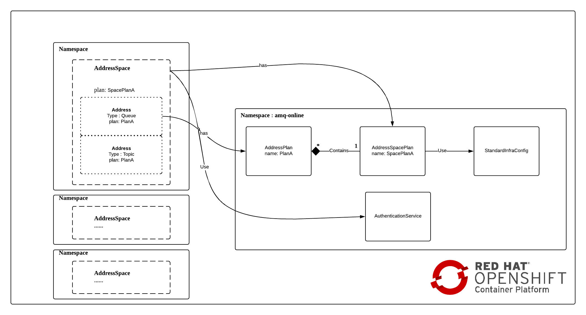

:data-uri:
:toc: left
:markup-in-source: +verbatim,+quotes,+specialcharacters
:source-highlighter: rouge
:icons: font
:stylesdir: stylesheets
:stylesheet: colony.css

= Understand AMQ Online

.Goals

* Understand the concepts of AMQ Online
* How to use AMQ Online

:sectnums:

== AMQ Online Components
AMQ Online is a solution (Operator) to manage multiple components to provide the over all functionality of running self-service (Messaging as a Service) messaging platform on OpenShift

* AMQ Broker :
** AMQ Broker is a full-featured, message-oriented middleware broker. It offers advanced addressing and queueing, fast message persistence, and high availability. AMQ Broker supports multiple protocols and operating environments, enabling you to use your existing assets.
** This is where all your brokers hosted and it is responsible for persisting messages.
* AMQ Interconnect :
** AMQ Interconnect provides flexible routing of messages between AMQP-enabled endpoints, including clients, brokers, and standalone services. With a single connection into a network of AMQ Interconnect routers, a client can exchange messages with any other endpoint connected to the network.
** This is where all your routes hosted (it will come later when explaining address).

TIP: For more information regarding different AMQ separate products, please refer to https://access.redhat.com/documentation/en-us/red_hat_amq/7.5/html/introducing_red_hat_amq_7/components#broker

* keycloak :
** Open Source Identity and Access Management, which is used to host access control information for queues, topic,etc.

==  Understanding AMQ Online Custom Types
After installing AMQ Online it defines new types (CRDs) which we will try to briefly explain them.

=== AuthenticationService
Describes an authentication service instance used to authenticate massaging clients. This is simply your way to configure keycloak server itself.

===  AddressSpacePlan
Describes the messaging resources available for address spaces (will come later) using this plan (so it an aggregate of all <<AddressPlan>>),
such as the available address plans and the amount of router and broker resources that can be used.
Think of it like the main quota control, it knows how much hardware can be used by referring to infrastructure configuration.
[IMPORTANT] It Defines the infrastructure to be deployed, and as it's name depicts "plan" it define quota restrictions (i.e., maximum number of addresses)

===  AddressPlan
Describes the messaging resources consumed by a particular address using this plan, such as what fraction of routers and brokers an address will use and other properties that should be set for multiple addresses.

=== Infrastructure configuration
as name suggested, it configures the hardware resource allocated to the components, such as CPU. memory, storage of console, broker and router, also some other specific config too.
it mainly two types;

==== StandardInfraConfig
This will allow you to host both AMQ Brokers, and AMQ Interconnect routes

==== BrokeredInfraConfig
This will allow you to host both AMQ Brokers only.

==== Address Space
Group of addresses accessible through single connection

==== Address
Defines semantics of address, Has set of properties

* Available address types determined by the address space type
* Available plans determined by the address type

* Address Space - refer back to AddressSpacePlan and here the magic happen as it go and create AMQ broker pod and AMQ Interconnect Pod base on the type (standard or brokered), also it like them with keycloak (AuthenticationService) as authentication/authorization source, and do all needed configuration .
* Address - the destinations which use the spinned pods from AddressSpace to configure broker or routers.
* Message User - defines the authentication/authorization attributes (which user can do what) for destination (like queue or topic). It mainly go and write the rules to keycloak.

[IMPORTANT]
====
* A single router and broker pod has a maximum usage of one. If a new address requires additional resources and the resource consumption is within the address space plan limits, a new pod will be created automatically to handle the increased load.

* A single router can support five instances of addresses (0.2) and broker can support three instances of addresses (0.3)  with this plan. If the number of addresses with this plan increases to four, another broker is created. If it increases further to six, another router is created as well.

* In the standard address space, address plans for the queue address type may contain a field partitions, which allows a queue to be shared across multiple brokers for HA and improved performance. Specifying an amount of broker resource above 1 will automatically cause a queue to be partitioned.
====

==  Understanding AMQ Online from Roles & Responsibilities point of View
There are two main roles in AMQ Online;

=== Admins
Admin does the installation of the platform foundation on OpenShift, they install all the basic elements that controls all the needed brokers, routers, user console and monitoring tools, and also takes care of setting up the authentication and authorization of who has access to the platform. We don't always have unlimited computing resource for all users, admin also has control over the resource limitation and create different plans that can apply to accompany different needs from users.

=== Developers / Application Owners / Tenants
They are the users of the platform, they will be creating "Address Space", and create destinations by applying the plans on top of it.  After the queue and topics are created, the tenants can go ahead and create credentials maps (MessagingUser) to different access roles, they can decide what account has access to admin console, which account has consume/produce right to any addresses(queues/ topics) in the Address Space. Please note, tenants will have no visibility to queue or topics of other Address Space, unless specially specified. Once the address are created and config correctly, application will be able to use the credential to read/write to the messaging address.

So A typical workflow will be;

. Admins install AMQ online from Operator Hub or install it manually
. Admins will create needed objects in amq-online namespace
.. Define AuthenticationService(s)
.. Define StandardInfraConfig(s) Or BrokeredInfraConfig(s)
.. Define AddressSpacePlan
.. Define AddressPlan
. Each Tenant will create needed objects in his own namespace
.. Define AddressSpace
.. Define Address
.. Define MessageUser

IMPORTANT: Each application owner will create separate Address and AddressSapce in their namespace utilizing what Administrators created as infra objects.

==  Understanding what is the difference between Standard and Brokered InfraConfig
[id='ref-supported-features-table-{context}']
.Supported features reference table
[cols="25%a,25%a,25%a,25%a",options="header"]
|===
|Feature | |Brokered address space |Standard address space
.5+|Address type |Queue |Yes |Yes
|Topic |Yes |Yes
|Multicast |No |Yes
|Anycast |No |Yes
|Subscription |No |Yes
.5+|Messaging protocol | AMQP |Yes |Yes
|MQTT |Yes |Technology preview only
|CORE |Yes |No
|OpenWire |Yes |No
|STOMP |Yes |No
.2+|Transports |TCP |Yes |Yes
|WebSocket |Yes |Yes
.2+|Durable subscriptions |JMS durable subscriptions |Yes |No
|"Named" durable subscriptions |No |Yes
.3+|JMS |Transaction support | Yes |No
|Selectors on queues |Yes |No
|Message ordering guarantees (including prioritization) |Yes |No
.1+|Scalability |Scalable distributed queues and topics
 |No |Yes
|===

== Installing AMQ Online on OpenShift 4.x server

There are two ways for installing AMQ online.

. Using the source files for RedHat portal.
. Using the AMQ online operator from OperatorHub.

* For ease of use i created a oc cli script which effectively use OperatorHub for installation link:script/install-amq-online.sh[install-amq-online.sh].

== JMS clients and libraries
There are multiple JMS Clients depending on the underlying Messaging Protocol (as shown in above table) each one have a set features and may have also some limitations.

* Messaging Protocol
.. **AMQP**: AMQP JMS client provides full AMQP 1.0 support and works with any AMQ server.
+
AMQ AMQP JMS is a [underline]#Java Message Service (JMS) 2.0# client for use in messaging applications that send and receive AMQP messages.
+
... Key features
.... JMS 1.1 and 2.0 compatible
.... SSL/TLS for secure communication
.... Flexible SASL authentication
.... Automatic reconnect and failover
.... Distributed tracing based on the OpenTracing standard
.... Ready for use with OSGi containers
.... Pure-Java implementation
+
... Procedure
.... Add the Red Hat repository to your Maven settings or POM file. For example configuration files, see Section B.1, “Using the online repository”.
+
[source,xml]
----
<repository>
  <id>red-hat-ga</id>
  <url>https://maven.repository.redhat.com/ga</url>
</repository>
----
.... Add the client dependency to your POM file.
+
[source,xml]
----
<dependency>
  <groupId>org.apache.qpid</groupId>
  <artifactId>qpid-jms-client</artifactId>
  <version>0.45.0.redhat-00002</version>
</dependency>
----
The client library is now available in your Maven project.
+
[IMPORTANT]
.Important Note on AMQ JMS client for AMQP
====
AMQ JMS does not currently support distributed transactions (XA). If your application requires distributed transactions, it is recommended that you use the AMQ Core Protocol JMS client.
====
for more info refer to https://access.redhat.com/documentation/en-us/red_hat_amq/7.5/html-single/using_the_amq_jms_client/index[]
.. **OPENWIRE**: OPENWIRE JMS CLIENT
+
AMQ OpenWire JMS is a [underline]#Java Message Service (JMS) 1.1# client for use in messaging applications that send and receive OpenWire messages. To support existing applications based on A-MQ 6
+
... Key features
.... JMS 1.1 compatible
.... SSL/TLS for secure communication
.... Automatic reconnect and failover
.... Distributed transactions (XA)
.... Pure-Java implementation
+
... Procedure
.... Add the Red Hat repository to your Maven settings or POM file. For example configuration files, see Section B.1, “Using the online repository”.
+
[source,xml]
----
<repository>
  <id>red-hat-ga</id>
  <url>https://maven.repository.redhat.com/ga</url>
</repository>
----
.... Add the library dependency to your POM file.
+
[source,xml]
----
<dependency>
  <groupId>org.apache.activemq</groupId>
  <artifactId>activemq-client</artifactId>
  <version>5.11.0.redhat-630329</version>
</dependency>
----
The client is now available in your Maven project.
+
for more info refer to https://access.redhat.com/documentation/en-us/red_hat_amq/7.5/html-single/using_the_amq_openwire_jms_client/index[]
.. **CORE**: AMQ Core Protocol JMS is a J[underline]##ava Message Service (JMS) 2.0## client for use in messaging applications that send and receive Artemis Core Protocol messages. Artemis core is a messaging system with its own API.
+
... Key features
.... JMS 1.1 and 2.0 compatible
.... SSL/TLS for secure communication
.... Automatic reconnect and failover
.... Distributed transactions (XA)
.... Pure-Java implementation
+
... Procedure
.... Add the Red Hat repository to your Maven settings or POM file.
+
[source,xml]
----
<repository>
  <id>red-hat-ga</id>
  <url>https://maven.repository.redhat.com/ga</url>
</repository>
----
+
.... Add the library dependency to your POM file.
+
[source,xml]
----
<dependency>
  <groupId>org.apache.activemq</groupId>
  <artifactId>artemis-jms-client</artifactId>
  <version>2.9.0.redhat-00002</version>
</dependency>
----
The client is now available in your Maven project.
+
for more info refer to https://access.redhat.com/documentation/en-us/red_hat_amq/7.5/html-single/using_the_amq_core_protocol_jms_client/index[]

== Building the Publisher Subscriber Usecase
As mentioned in the previous section, the main usecase is a Publisher Subscriber usecase.
This usecase is built using Standard Address.

I will not go too much in the details of the Infrastructure components as the focus here is the application part.

=== Defining the needed Yamls
As Discussed in concepts each Tenant (application in our case), will create following set of objects

. AddressSpace
+
[source,yaml]
----
apiVersion: enmasse.io/v1beta1
kind: AddressSpace
metadata:
  name: dt-ar
  namespace: amq-online-test
spec:
  type: standard
  endpoints:
    - name: messaging
      service: messaging
      expose:
        type: route
        annotations: {}
        routeServicePort: amqps
        routeTlsTermination: passthrough
        loadBalancerPorts: []
        loadBalancerSourceRanges: []
      exports: []
    - name: messaging-wss
      service: messaging
      expose:
        type: route
        annotations: {}
        routeServicePort: https
        routeTlsTermination: reencrypt
        loadBalancerPorts: []
        loadBalancerSourceRanges: []
      exports: []
    - name: console
      service: console
      expose:
        type: route
        annotations: {}
        routeServicePort: https
        routeTlsTermination: reencrypt
        loadBalancerPorts: []
        loadBalancerSourceRanges: []
      exports: []
  plan: standard-small
  authenticationService:
    name: standard-authservice
  connectors: []
----
. Address
In the Pub/Sub usecase we will need to create two Addresses; One which is the topic, and subscription for each durable subscriber we want.
Please note that we are using Standard Plan and "Named" durable subscriptions is the way to achieve this durability.
+
[source,yaml]
----
kind: Address
apiVersion: enmasse.io/v1beta1
metadata:
  annotations:
    enmasse.io/version: '0.30'
spec:
  address: AR-TEST-TOPIC-VNK
  type: topic <1>
  plan: standard-small-topic
  forwarders: []
----
<1> This is the type of the Address is topic which will be used by producers
+
[source,yaml]
----
kind: Address
apiVersion: enmasse.io/v1beta1
metadata:
  annotations:
    enmasse.io/version: '0.30'
spec:
  address: mysub
  type: subscription <1>
  plan: standard-small-subscription
  topic: AR-TEST-TOPIC-VNK <2>
  forwarders: []
----
<1> This is the subscription (or the durable consumer), that will be used by a specific consumer to be durable.
<2> Reference to the topic, created in previous step.
. Define MessageUser
+
[source,yaml]
----
apiVersion: user.enmasse.io/v1beta1
kind: MessagingUser
metadata:
  name: dt-ar.ar-user
  namespace: amq-online-test
spec:
  username: ar-user
  authentication:
    type: password
  authorization:
    - addresses:
        - '*'
        - AR*
        - mysub
        - mysubscription
      operations:
        - recv
        - send
    - addresses: []
      operations:
        - manage
    - addresses: []
      operations:
        - view
----

=== Building the Sample Java Code
A full sample java code, you can find it at https://github.com/rahmed-rh/jms-demo
One key point is that the producer should produce to topic using topic name and consumer should consume from subscription using (topic_name::subscription_name) but as **queue**.

[source,java]
----
JMSProducer producer = new JMSProducer(connectionFactory, getTopic("AR-TEST-TOPIC-VNK")); <1>
JMSConsumer durableConsumer1 = new JMSConsumer(connectionFactory, getQueue("AR-TEST-TOPIC-VNK::mysub")); <2>
----
<1> Produce using JMS Topic
<2> Consume using JMS Queue
