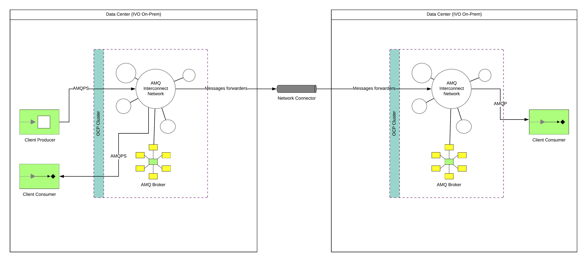

= AMQ Online Multi-cluster deployment

The idea is to deploy AMQ online on top of OpenShift deployed in two data centers, and to configure
AMQ Online connectors & Forwarders for communication between AMQ online deployed on separate clusters.

This is a proposed design that can mitigate the site fail-over or cross sites messaging solution.

In AMQ Online, You can federate a standard address space type with another AMQP server.

Two methods of operation are supported: *remote address connection* and *message store-and-forward*.

* Remote address connection involves mapping addresses on a remote AMQP endpoint into an address space.
For example, suppose an AMQP server is running on the host messaging.example.com that you want to access by connecting using the AMQ Online endpoints.
To enable remote address connection, you need to create an [underline]##address space connector##.

* Message store-and-forward involves enabling address forwarding.

You can use forwarders to:

* automatically forward messages from a local address to a remote AMQP server outside of AMQ online, or
* forward messages from a remote AMQP server to a local address.

First you need to create an address space connector. Then, you need to create an address forwarder for each address.

In this sample, I'm targeting the store and forward pattern where messages will go from one site to another suite to form a "kind of" backup queues on the other site. Those backup queues will be truncated or used based on the need failover, retention,.. (controlled through logic {cus} team will build).

To fully understand the underlying details, we explained in <<../understand#bookmark-understand-components>> section that one of the underlying components in AMQ Online, is <<#bookmark-amq-interconnect>>. https://access.redhat.com/documentation/en-us/red_hat_amq/7.5/html-single/using_amq_interconnect/index#connecting-routers-router-rhel[AMQ Interconnect provides the infrastructure needed for Connecting qpid routers to another router in the router network], https://access.redhat.com/documentation/en-us/red_hat_amq/7.5/html-single/using_amq_interconnect/index#configuring-brokered-messaging-router-rhel[Also AMQ Interconnect allows clients connect to a router to send and receive messages, and the router routes the messages to or from queues on a message broker].

This boilerplate code and configuration is abstracted through the usage of AMQ Online.
